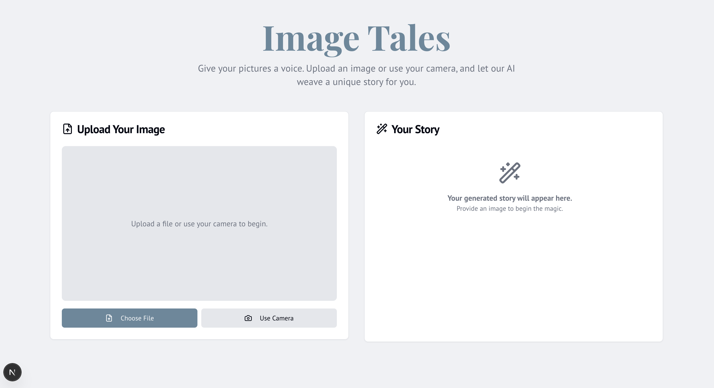

# Image-Tales
Image Tales is a Next.js web app that uses AI to transform your images into unique, creative stories.
Just ADD The node Modules with "node init" and You GEMINI_API_KEY and See the MAGIC 🪄.

# Detailed Description
A web application built with Next.js. Its main feature is to generate creative stories based on an image that a user provides.
Users can either upload an image file from their device or use their device's camera to capture a new photo directly in the browser. Once an image is submitted, the application sends it to a backend AI model which then creates and returns a unique story inspired by the image content.

The interface is split into two main sections: one for image input and another for displaying the generated story. The app also includes features like a loading state while the AI is working and the ability to copy the final story to the clipboard.

Technically, it's a modern web app using:

Next.js and React for the user interface.
TypeScript for type-safe code.
Tailwind CSS and ShadCN UI for a clean, modern design.
Genkit with a Google AI model to handle the core AI-powered story generation.

Here’s a preview:

## Core Features:

- Image Input: Capture image through device's camera or upload from device storage.
- AI Story Generation: Generate a story based on the provided image using generative AI; the story shall adapt to any content detected, using any suitable creative writing tools, such as metaphor.
- Story Display: Display the generated story in a clean and readable format.
- Story Copying: Allow users to copy the story to their clipboard.

## Style Guidelines:

- Primary color: A calm blue (#67899C), inspired by the idea of 'once upon a time', storytelling and calm contemplation.
- Background color: Very light gray (#F0F2F5), nearly white, creating a clean backdrop for the image and text.
- Accent color: A muted coral (#C06C84) for highlights and calls to action, creating contrast and focus.
- Headline font: 'Playfair', a modern sans-serif for headlines, bringing an elegant feel.
- Body font: 'PT Sans' will be paired with Playfair for body text. This combination brings readability and balance to the content.
- Use simple, outline-style icons for actions like camera, upload, and copy.
- Subtle animations for loading and transitions, providing a smooth user experience.
